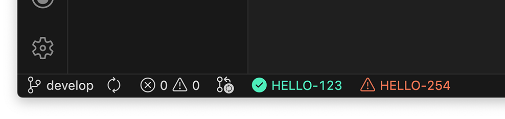

Monitors the status of GitHub pull requests. Checks if a pull request is mergable, including the status of reviews, merge conflicts and checks. Initially based off of 'Pull Request Monitor' by Erich Behrens.

## Usage

1. Generate a GitHub token with the `public_repo` permission at https://github.com/settings/tokens.

    > (if you wish to monitor private repositories too, include `repo`)

2. Open the command palette and execute `mitchells-monitor.setToken`; after setting your token the extension will start monitoring your pull requests and display them in the status bar.
